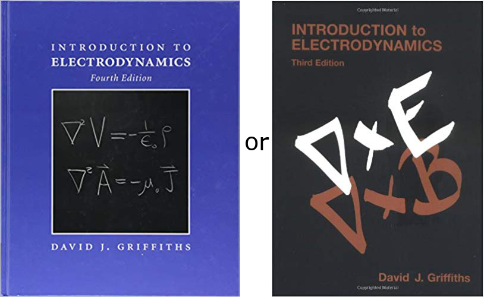

<section data-markdown="">

### I'm Evan (he/him/his)

Office: Carroll 108C
Email: &lt;etilton@regis.edu&gt;

Try not to use email except for personal matters...

Who are y'all?

</section>

<section data-markdown="">

### Books

| Required | Optional |
| --- | --- |
|  |  |

</section>

<section data-markdown="">
	
### Important Sites

* Course Webpage: [evantilton.com/ph410f19](http://evantilton.com/ph410f19)
* Slack Team: [ph410f19.slack.com](http://ph410f19.slack.com)
  * *You should already be a part of this.*

</section>

<section data-markdown="">

### Course Activities
* Midterm Exams (2 of them) - 15% each
* Final Exam  - 20%
* Homework (Lots of it; mostly due on Fridays) - 40%
* Participation (Reading quizzes, Slack polls, etc) - 10%

[Much more detail on website](http://evantilton.com/ph410f19)

</section>

<section data-markdown="">
### Exam corrections

Exams can be very stressful.

* For both Exam 1 and 2, you will be allowed to rework the exams to earn up to 50% of the credit back.

* You will need to rework the exam and turn written reflection about what you did incorrectly.
</section>

<section data-markdown="">

## This Week!!!

* Homework 1 is already up (Due ???)
* Read (seriously do this!) Griffiths....
* Get Python, Slack, and Github working

**Stay up-to-date by checking website, calendar, and Slack regularly.**

*Chapter 1 of Griffiths should be mostly review.*

</section>

<section data-markdown="">

### Homework problems

* We will be using Python on homework problems this semester. You are welcome to use any distribution, but I recommend [Google Colab](https://colab.research.google.com) or [Anaconda](https://www.continuum.io/downloads)
* Installation help can be found at [evantilton.com/guides](http://evantilton.com/guides) or by talking on Slack
* Homework questions will take the form of a Jupyter notebook, which you can turn in by [linking a Github commit](http://evantilton.com/guides/linktogithubcommit/) via a Slack message. Make sure the file name clearly indicates what it is and who wrote it.
* If you get stuck somewhere, post on Slack, so your classmates benefit from your question. Use the channels and giphy responsibly.
* Regular written homework should be turned in on paper if handwritten. Alternately, you are welcome to typeset it in LaTeX or Markdown and share it via Slack or Github, but I won't accept it unless you typeset using standard mathematical notation and convention.

</section>

<section data-markdown="">

### Committment to an Inclusive Classroom

I am committed to creating an inclusive classroom.  If I can do anything to make the classroom a better learning environment for you, please let me know.

If you observe or experience behaviors that violate our committment to inclusivity, please let me know as soon as possible.

If I violate this principle, please let me know or please tell the physics chair.

</section>

<section data-markdown="">

### Confidentiality and Mandatory Reporting

One of my responsibilities is to help create a safe learning environment. It is my goal that you feel able to share information related to your life experiences. I will seek to keep information you share private.

However, I am required to share information regarding sexual misconduct, relationship violence, or information about criminal activity with the university.

Students may speak to someone confidentially by contacting the Office of Counseling and Personal Development. OCPD is located in the Coors Life Direction Center, Room 114 and can be contacted by phone 24/7 at 303-458-3507. See www.regis.edu/ocpd.

</section>

<section data-markdown="">
	
### Personal Integrity

Let's talk about what that means for class, exams, and homework.

</section>

<section data-markdown="">
	
### Advice 

What advice do you have for each other?

</section>

<section data-markdown="">

## What do you think PH410 is about?

</section>

<section data-markdown="">

### Electromagnetism is the foundational field theory of physics

Think about everything you already know about electromagnetism (it's a lot already!).

Work with a partner to map out the electromagnetism concepts that you know and how they are related to each other.

</section>
