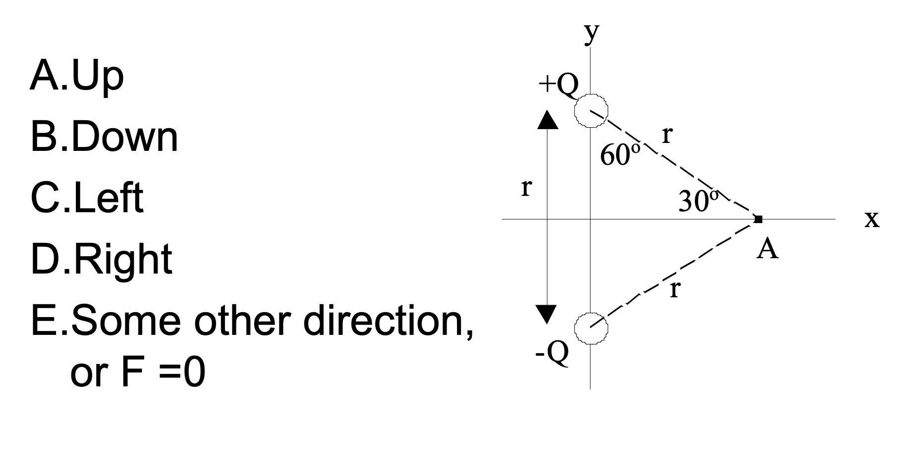
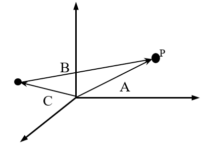
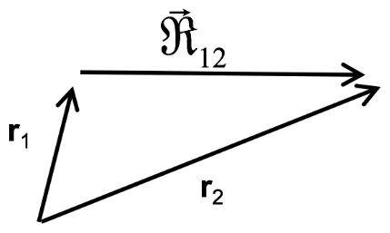

<section data-markdown="">
		
### PH410 - Electromagnetism

August 28 
 <!--this doesn't work... -->
</section>

<section data-markdown="">

### For Friday
- Read Griffiths Sections 1.3 and 1.4
- Do reading survey by 10am on Friday (on Slack, same as first one...I'll call this one s2)
	
</section>

<section data-markdown="">
	
## Textbook stuff
### Errata
https://www.reed.edu/physics/faculty/griffiths/
### Remember to read actively!
Have a pen & paper, work things out and check things!
</section>

<section data-markdown="">

### Have you looked at the homework?
1. No, I haven't looked at it.
2. Yes, I looked at it but did none of it.
3. Yes, I did the computer setup, but nothing else.
4. Yes, I did some of the problems, but not the computer setup.
5. I've made progress on both the computer setup and the problems.

</section>

<!--
<section data-markdown="">

## What do you think PH410 is about?

</section>
-->

<section data-markdown="">

### Electromagnetism is the foundational field theory of physics

Think about everything you already know about electromagnetism (it's a lot already!).

<!-- Work with a partner to map out the electromagnetism concepts that you know and how they are related to each other. -->

</section>
<section data-markdown>

## Mathematical Preliminaries

$\nabla \cdot \mathbf{E}=\frac{\rho}{\epsilon_{0}} \qquad \oint \mathbf{E} \cdot d \mathbf{a}=\frac{Q_{\mathrm{enc}}}{\epsilon_{0}}$

$\nabla \cdot \mathbf{B}=0 \qquad \oint \mathbf{B} \cdot d \mathbf{a}=0$

$\nabla \times \mathbf{E}=\color{gray}{-\frac{\partial \mathbf{B}}{\partial t}} \qquad \oint \mathbf{E} \cdot d \mathbf{l}=\color{gray}{-\int \frac{\partial \mathbf{B}}{\partial t} \cdot d \mathbf{a}}$

$\nabla \times \mathbf{B}=\mu_{0} \mathbf{J}\color{gray}{+\mu_{0} \epsilon_{0} \frac{\partial \mathbf{E}}{\partial t}} \qquad \oint \mathbf{B} \cdot d \mathbf{l}=\mu_{0} I_{\mathrm{enc}}\color{gray}{+\mu_{0} \epsilon_{0} \int \frac{\partial \mathbf{E}}{\partial t} \cdot d \mathbf{a}}$

Note:
There's a reason that we are starting with vectors and vector operations; it's inherent in the way electromagnetism is described!
</section>
<section data-markdown>

In a typical Cartesian coordinate system, vector $\mathbf{A}$ lies along the $+\hat{x}$ direction and vector $\mathbf{B}$ lies along the $-\hat{y}$ direction. What is the direction of $\mathbf{A} \times \mathbf{B}$?

1. $-\hat{x}$
2. $+\hat{y}$
3. $+\hat{z}$
4. $-\hat{z}$
5. Can't tell

Note:
* Correct Answer: D
* Use the right-hand rule
* Fall 2016: 0 0 23 [77]

</section>

<section data-markdown>

In a typical Cartesian coordinate system, vector $\mathbf{A}$ lies along the $+\hat{x}$ direction and vector $\mathbf{B}$ lies along the $-\hat{y}$ direction. What is the direction of $\mathbf{B} \times \mathbf{A}$?

1. $-\hat{x}$
2. $+\hat{y}$
3. $+\hat{z}$
4. $-\hat{z}$
5. Can't tell

Note:
* Correct Answer: C
* Use right-hand rule; means $\mathbf{A} \times \mathbf{B} = - \mathbf{B} \times \mathbf{A}$
* Fall 2016: 0 0 [94] 6 0
</section>
<section data-markdown="">
	
Two charges $+Q$ and $-Q$ are fixed a distance $r$ apart. The direction of the force on a test charge $-q$ at point A is:

 

Note:
* CORRECT ANSWER:  A
* Use superposition
</section>
<section data-markdown="">
	
In terms of primed and/or unprimed Cartesian coordinates using Griffiths-style notation, what is the magnitude of vector B if P is some point at which you need to find the electric field due to the point charge?

 

Note:

</section>
<section data-markdown>

How is the vector $\mathfrak{R}_{12}$ related to $\mathbf{r}_1$ and  $\mathbf{r}_2$?

 

1. $\mathfrak{R}_{12} = \mathbf{r}_1 +\mathbf{r}_2$
2. $\mathfrak{R}_{12} = \mathbf{r}_1 - \mathbf{r}_2$
3. $\mathfrak{R}_{12} = \mathbf{r}_2 - \mathbf{r}_1$
4. None of these

Note:
* CORRECT ANSWER:  C

</section>

<section data-markdown>

Coulomb's Law: $\mathbf{F}  = \frac{k q_1 q_2}{\left|\mathfrak{R}\right|^2}\hat{\mathfrak{R}}$ where $\mathfrak{R}$ is the relative position vector. In the figure, $q_1$ and $q_2$ are 2 m apart. Which arrow **can** represent $\hat{\mathfrak{R}}$?

 

1. A
2. B
3. C
4. More than one (or NONE) of the above
5. You can't decide until you know if $q_1$ and $q_2$ are the same or opposite charges

Note:
* CORRECT ANSWER: D
* A unit vector has no units; so it's length is meaningless on a picture with units.
* Fall 2016 (hint given while still open): 14 10 9 [44] 23; students wanted to discuss E

</section>

<section data-markdown>

**True or False** The following mathematical operation makes sense and is technically valid.

$$\nabla \cdot \nabla T(x,y,z)$$

1. Yes, it will produce a vector field.
2. Yes, it will produce a scalar field.
3. No, you can not take the divergence of a scalar field.
4. I don't remember what this means.

Note:
* Correct answer: B

</section>

<section data-markdown>

Which of the following two fields has zero divergence?

| I | II |
|:-:|:-:|
|  |   |

1. Both do.
2. Only I is zero
3. Only II is zero
4. Neither is zero
5. ???

Note:
* CORRECT ANSWER: B
* Think about dE/dx and dE/dy
</section>

<section data-markdown>
	
 
	
</section>
<section data-markdown>

Which of the following two fields has zero curl?

| I | II |
|:-:|:-:|
|  |   |

1. Both do.
2. Only I is zero
3. Only II is zero
4. Neither is zero
5. ???

Note:
* CORRECT ANSWER: C
* Think about paddle wheel
</section>
<section data-markdown>

Curl/div visualizations 

https://mathinsight.org/divergence_idea

https://mathinsight.org/divergence_subtleties

https://mathinsight.org/curl_components

https://mathinsight.org/curl_subtleties

</section>
<section data-markdown="">

## Take a minute to reflect.
What do you want out of this course? Perhaps a deeper understanding of the universe, perhaps better critical thinking skills, perhaps a certain grade. 

Are you on the right path for your own goals, whatever they are, for this semester? Are you reading how you should for where you're at with you current skills? Thinking deeply enough about the homework? 

</section>
