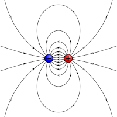

<section data-markdown="">
	
# DRAFT DRAFT DRAFT	
### PH410 - Electromagnetism

August 28 
 <!--this doesn't work... -->
</section>

<section data-markdown="">
	
## Textbook stuff
### Errata
https://www.reed.edu/physics/faculty/griffiths/
### Remember to read actively!
Have a pen & paper, work things out and check things!
</section>

<section data-markdown="">

### For Friday
- Read Griffiths Sections 1.3 and 1.4
- Do reading survey by 10am on Friday (on Slack, same as first one...I'll call this one s2)
	
</section>
<section data-markdown="">

### Have you looked at the homework?
1. No, I haven't looked at it.
2. Yes, I looked at it but did none of it.
3. Yes, I did the computer setup, but nothing else.
4. Yes, I did some of the problems, but not the computer setup.
5. I've made progress on both the computer setup and the problems.

</section>

<section data-markdown="">

## What do you think PH410 is about?

</section>

<section data-markdown="">

### Electromagnetism is the foundational field theory of physics

Think about everything you already know about electromagnetism (it's a lot already!).

Work with a partner to map out the electromagnetism concepts that you know and how they are related to each other.

</section>

<section data-markdown="">
	
Two charges $+Q$ and $-Q$ are fixed a distance $r$ apart. The direction of the force on a test charge $-q$ at point A is:

|  |  |
| :--- | --- |
| 1. Up   2. Down   3. Left \\ 4. Right   5. Some other direction, or $\vec{F}=0$ |  |

	
</section>
