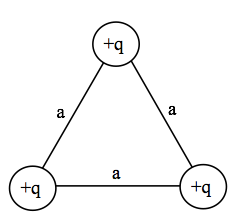

<section data-markdown="">

### PH410 - Electromagnetism

September 23
<!--this doesn't work... -->
</section>

<section data-markdown>

### Last time, we ended on boundary conditions. $\mathbf{E}$ can be discontinuous, but $V$ cannot. While we wait...

Without referring to Griffiths, use Gauss to calculate the E field above and below an infinite plane of surface charge $\sigma$. By how much is $\mathbf{E}$ discontinous, comparing points just above and just below the plane?

</section>

<section data-markdown="">

### For *Friday*
- Griffiths Section 3.1
- Reading survey

HW posted, due  Friday 

#### Exam 1 is Oct 7
	
</section>

<section data-markdown>

### Last time, we ended on boundary conditions

- $\mathbf{E}$ can be discontinuous, but $V$ cannot.
- $E^\perp_{\rm above}-E^\perp_{\rm below}=\frac{\sigma}{\epsilon_0}$
- What about $E^\parallel$?

</section>
<section data-markdown>

### Electrostatic Potential Energy

</section>

<section data-markdown>

Consider slowly moving a positive charge from a location of low electric potential to one of high electric potential. What is the sign of the work done by you ($W_u$)? What is the sign of the work done by electric field ($W_f$)?

1. $W_u < 0$; $W_f > 0$
2. $W_u < 0$; $W_f < 0$
3. $W_u > 0$; $W_f > 0$
4. $W_u > 0$; $W_f < 0$

Note: Correct Answer is D; Draw field

</section>

<section data-markdown>

Three identical charges $+q$ sit on an equilateral triangle. What would be the final $KE$ of the top charge if you released it (keeping the other two fixed)?

1. $\frac{1}{4\pi\varepsilon_0}\frac{q^2}{a}$
2. $\frac{1}{4\pi\varepsilon_0}\frac{2q^2}{3a}$
3. $\frac{1}{4\pi\varepsilon_0}\frac{2q^2}{a}$
4. $\frac{1}{4\pi\varepsilon_0}\frac{3q^2}{a}$
5. Other

Note:
CORRECT ANSWER: C

</section>

<section data-markdown>

Three identical charges $+q$ sit on an equilateral triangle. What would be the final $KE$ of the top charge if you released *all three*?

1. $\frac{1}{4\pi\varepsilon_0}\frac{q^2}{a}$
2. $\frac{1}{4\pi\varepsilon_0}\frac{2q^2}{3a}$
3. $\frac{1}{4\pi\varepsilon_0}\frac{2q^2}{a}$
4. $\frac{1}{4\pi\varepsilon_0}\frac{3q^2}{a}$
5. Other

Note:
CORRECT ANSWER: A

</section>
