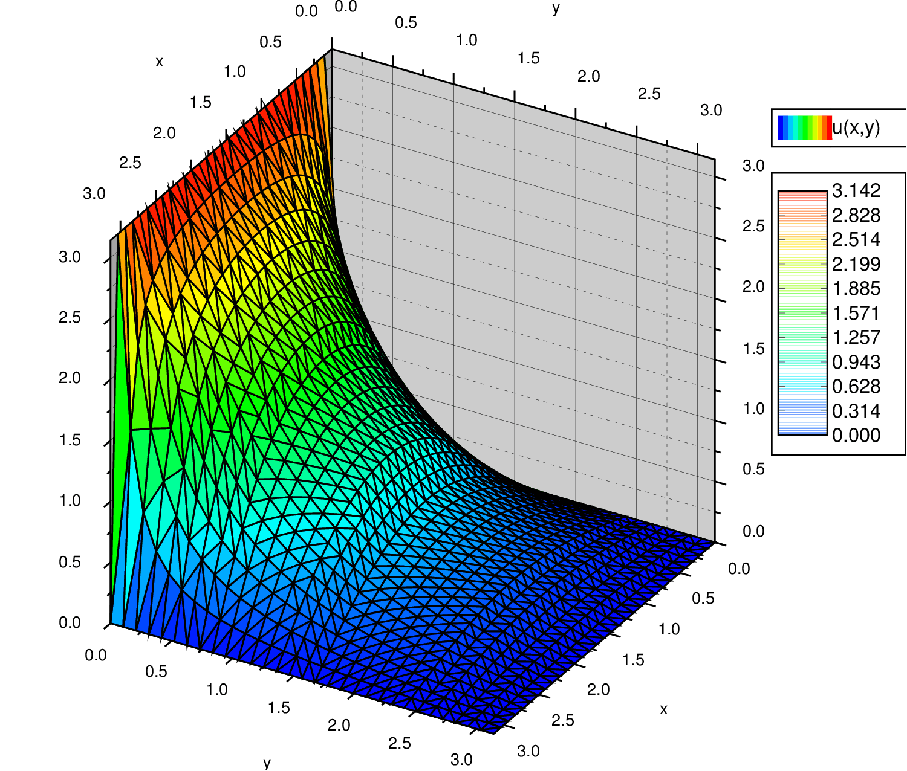
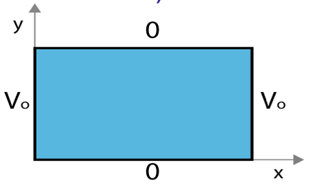

 
<section data-markdown="">

### PH410 - Electromagnetism

October 4
<!--this doesn't work... -->
</section>

<section data-markdown="">

#### Exam 1 is Monday, Oct 7
	
</section>

<section data-markdown>

### Separation of Variables (Cartesian)

<!--https://jeremykun.com/2016/09/26/voltage-temperature-and-harmonic-functions/-->

</section>

<section data-markdown>

Say you have three functions $f(x)$, $g(y)$, and $h(z)$.
$f(x)$  depends on $x$ but not on $y$ or $z$.
$g(y)$ depends on $y$ but not on $x$ or $z$.
$h(z)$ depends on $z$ but not on $x$ or $y$.

If $f(x) + g(y) + h(z) = 0$ for all $x$, $y$, $z$, then:

1. All three functions are constants (i.e. they do not depend on $x$, $y$, $z$ at all.)
2. At least one of these functions has to be zero everywhere.
3. All of these functions have to be zero everywhere.
4. All three functions have to be linear functions in $x$, $y$, or $z$ respectively (such as $f(x)=ax+b$)

Note:
* CORRECT ANSWER: A

</section>

<section data-markdown>

If our general solution contains the function,

$$X(x) = Ae^{\sqrt{c}x} + Be^{-\sqrt{c}x}$$

What does our solution look like if $c<0$; what about if $c>0$?

1. Exponential; Sinusoidal
2. Sinusoidal; Exponential
3. Both Exponential
4. Both Sinusoidal
5. ???

Note:
* CORRECT ANSWER: B

</section>

<section data-markdown>

Our example problem has the following boundary conditions:

* $V(0,y>0) = 0; V(a,y>0) = 0$
* $V(x_{0\rightarrow a},y=0) = V_0; V(x,y\rightarrow \infty) = 0$

If $X''= c_1 X$ and $Y'' = c_2Y$ with $c_1 + c_2 = 0$, which is constant is positive?

1. $c_1$
2. $c_2$
3. It doesn't matter either can be

Note:
* CORRECT ANSWER: B
* Exponential solutions are expected in the y direction
</section>

<section data-markdown>

Given the two diff. eq's :

$$\dfrac{1}{X}\dfrac{d^2X}{dx^2} = C_1 \qquad \dfrac{1}{Y}\dfrac{d^2Y}{dy^2} = C_2$$

where $C_1+C_2 = 0$.  Given the boundary conditions in the figure, which coordinate should be assigned to the negative constant (and thus the sinusoidal solutions)?

1. x
2. y
3. $C_1 = C_2 = 0$ here
4. It doesn't matter.

Note:
* CORRECT ANSWER: B
* Because it has to vanish on both ends
</section>

<section data-markdown>

Given the two diff. eq's :

$$\dfrac{1}{X}\dfrac{d^2X}{dx^2} = C_1 \qquad \dfrac{1}{Y}\dfrac{d^2Y}{dy^2} = C_2$$

where $C_1+C_2 = 0$.  Given the boundary conditions in the figure, which coordinate should be assigned to the negative constant (and thus the sinusoidal solutions)?

1. x
2. y
3. $C_1 = C_2 = 0$ here
4. It doesn't matter.

Note:
* CORRECT ANSWER: C
* It's constant throughout!
</section>
