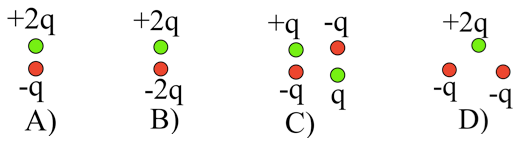
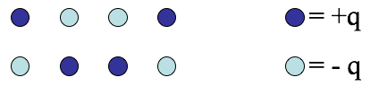
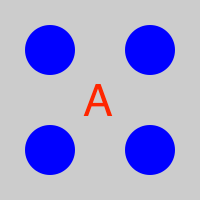
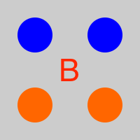
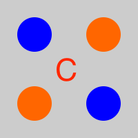
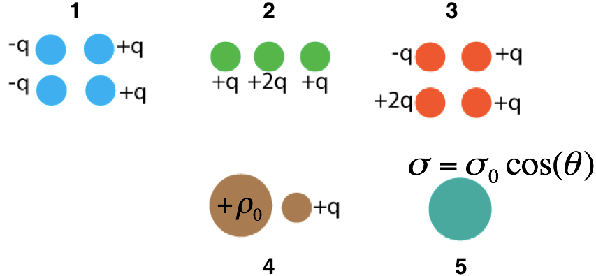

<section data-markdown="">

### PH410 - Electromagnetism

October 23

#### For Friday, read section 4.2 and 4.3

<!--this doesn't work... -->
</section>

<section data-markdown>
Law of cosines: $\mathfrak{r}^2=r^2+{r^\prime}^2-2rr^\prime \cos\theta^\prime=r^2\left(1+\left(\frac{r^\prime}{r}\right)^2-\frac{2r^\prime}{r}\cos\theta^\prime\right)$
  
If $\epsilon\equiv r^\prime/r$:
$$\mathfrak{r}=r\sqrt{1-2\epsilon\cos\theta^\prime+\epsilon^2}$$
$$\frac{1}{\mathfrak{r}}=\frac{1}{r}\left(1-2\epsilon\cos\theta^\prime+\epsilon^2\right)^{-1/2}$$

</section>

<section data-markdown>

Which charge distributions below produce a potential that looks like $\frac{C}{r^2}$ when you are far away?

E) None of these, or more than one of these!

(For any which you did not select, how DO they behave at large r?)

Note:
* CORRECT ANSWER: E (Both C and D)

</section>

<section data-markdown>

Which charge distributions below produce a potential that looks like $\frac{C}{r^2}$ when you are far away?

E) None of these, or more than one of these!

(For any which you did not select, how DO they behave at large r?)

Note:
* CORRECT ANSWER: E (Both B and D)

</section>

<section data-markdown>

In terms of the multipole expansion $V(r) = V(mono) + V(dip) + V(quad) + \dots$, the following charge distribution has the form:

1. $V(r) = V(mono) + V(dip) +\;$ higher order terms
2. $V(r) = V(dip) +\;$ higher order terms
3. $V(r) = V(dip)$
4. $V(r) =\;$ only higher order terms than dipole
5. No higher terms, $V(r) = 0$ for this one.

Note:
* CORRECT ANSWER: D

</section>
<!--
<section data-markdown>

Which of the following distributions could have a dipole contribution to the potential far from the charges?

D. None

E. More than one!

Note:
* CORRECT ANSWER: E
* We didn't specify where the origin!

</section>

<section data-markdown>

In which situation is the dipole term the leading non-zero contribution to the potential?

1. 1 and 3
2. 2 and 4
3. only 5
4. 1 and 5
5. Some other combo

Note:
* CORRECT ANSWER: D

</section>

<section data-markdown>

Consider a single point charge at the origin. It will have ONLY a monopole contribution to the potential at a location $\mathbf{r} = \langle x,y,z\rangle$.

As we have seen, if we move the charge to another location (e.g., $\mathbf{r}' = \langle 0,0,d \rangle$), the distribution now has a dipole contribution to the potential at $\mathbf{r}$!

What the hell is going on here?

1. It's just how the math works out. Nothing has changed physically at $\mathbf{r}$.
2. There is something different about the field at $\mathbf{r}$ and the potential is showing us that.
3. I'm not sure how to resolve this problem.

</section>
-->
<section data-markdown>
  # Solution to Reading Survey question
  
  This is Griffiths' solution (not mine):
  

</section>
