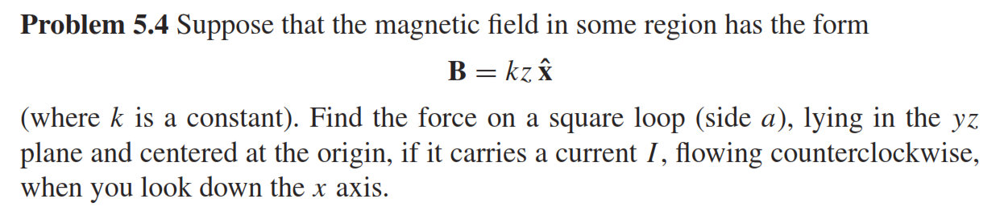
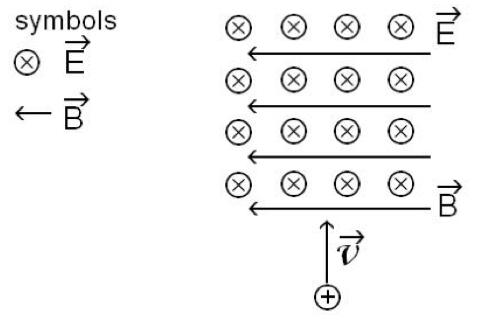
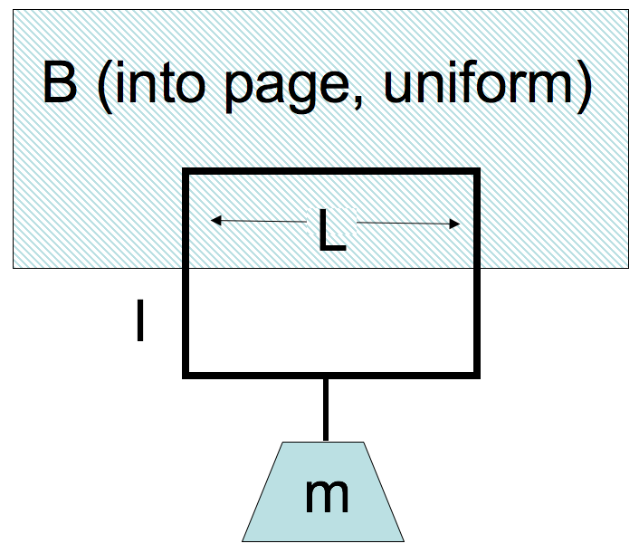

<section data-markdown="">

### PH410 - Electromagnetism

November 1

For Monday, read section 5.2.

While we wait, why not discuss how to solve Griffiths problem 5.4? Most people got it wrong, though it should be review from Phys 2.

<!--this doesn't work... -->
</section>

<section data-markdown>

A proton ($q=+e$) is released from rest in a uniform $\mathbf{E}$ and uniform $\mathbf{B}$.  $\mathbf{E}$ points up, $\mathbf{B}$ points into the page.  Which of the paths will the proton initially follow?

Note:
* CORRECT ANSWER: C
</section>

<section data-markdown>

A + charged particle moving up (speed $v$) enters a region with uniform $\mathbf{B}$ (left) and uniform $\mathbf{E}$ (into page). What's the direction of $\mathbf{F}_{net}$ on the particle, at the instant it enters the region?

1. To the left
2. Into the page
3. Out of the page
4. No net force
5. Not enough information

Note:
* CORRECT ANSWER: E
* The forces point in opposite directions, but not sure of their size
</section>

<section data-markdown>

A wire loop in a $B$ field has a current $I$. The B-field is localized, it's only in the hatched region, roughly zero elsewhere. Which way is $I$ flowing to hold the mass in place?

1. Clockwise
2. Counter-clockwise
3. You cannot "levitate" like this!

Note:
* CORRECT ANSWER: A

</section>

<section data-markdown>

A proton (speed $v$) enters a region of uniform $\mathbf{B}$. $v$ makes an angle $\theta$ with $\mathbf{B}$. What is the subsequent path of the proton?

1. Helical
2. Straight line
3. Circular motion, $\perp$ to page. (plane of circle is $\perp$ to $\mathbf{B}$)
4. Circular motion, $\perp$ to page. (plane of circle at angle $\theta$ w.r.t. $\mathbf{B}$)
5. Impossible.  $\mathbf{v}$ should always be $\perp$ to $\mathbf{B}$

Note:
* CORRECT ANSWER: A
</section>
