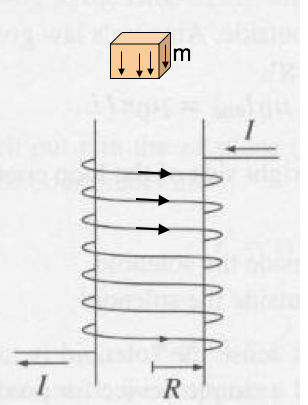
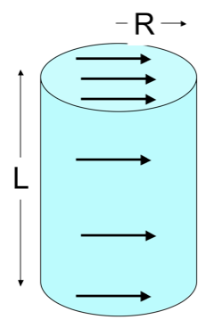
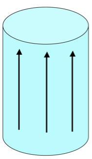
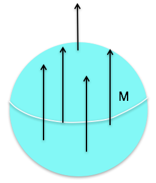
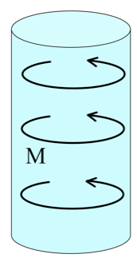

<section data-markdown="">

### PH410 - Electromagnetism

November 18

For Wednesday, read section 6.4 (i.e., finish chapter 6)
</section>

<section data-markdown>

Consider a paramagnetic material placed in a uniform external magnetic field, $\mathbf{B}_{ext}$. The paramagnetic magnetizes, so that the total magnetic field just outside the material is now...

1. smaller than
2. larger than
3. the same as

it was before the material was placed.

Note:
* Correct Answer: B

</section>

<section data-markdown>

A small chunk of material (the “tan cube”) is placed above a solenoid. It magnetizes, weakly, as shown by small arrows inside.
What kind of material must the cube be?

1. Dielectric
2. Conductor
3. Diamagnetic
4. Paramagnetic
5. Ferromagnetic

Note:
* CORRECT ANSWER: C

</section>

<section data-markdown>

A solid cylinder has uniform magnetization $\mathbf{M}$ throughout the volume in the $x$ direction as shown. What's the magnitude of the total magnetic dipole moment of the cylinder?

1. $\pi R^2 L M$
2. $2\pi R L M$
3. $2\pi R M$
4. $\pi R^2M$
5. Something else/it's complicated!

Note:
* CORRECT ANSWER: A

</section>

<section data-markdown>
  

A solid cylinder has uniform magnetization $\mathbf{M}$ throughout the volume in the $z$ direction as shown. Where do bound currents show up?

1. Everywhere
2. Volume only, not surface
3. Top/bottom surface only
4. Side (rounded) surface only
5. All surfaces, but not volume

Note:
* CORRECT ANSWER: D

</section>

<section data-markdown>
  

A solid cylinder has uniform magnetization $\mathbf{M}$ throughout the volume in the $x$ direction as shown. Where do bound currents show up?

1. Top/bottom surface only
2. Side (rounded) surface only
3. Everywhere
4. Top/bottom, and parts of (but not all of) side surface (but not in the volume)
5. Something different/other combination!

Note:
* CORRECT ANSWER: D

</section>

<section data-markdown>

A sphere has uniform magnetization $\mathbf{M}$ in the $+z$ direction. Which formula is correct for this surface current?

1. $M \sin \theta\,\hat{\theta}$
2. $M \sin \theta\,\hat{\phi}$
3. $M \cos \phi\,\hat{\theta}$
4. $M \cos \phi\,\hat{\phi}$
5. Something else

Note:
* CORRECT ANSWER: B

</section>
<!--
<section data-markdown>
  

A solid cylinder has uniform magnetization $\mathbf{M}$ throughout the volume in the $\phi$ direction as shown. In which direction does the bound surface current flow on the (curved) sides?

1. There is no bound surface current.
2. The current flows in the $\pm \phi$ direction.
3. The current flows in the $\pm s$ direction.
4. The current flows in the $\pm z$ direction.
5. The direction is more complicated.

</section>
-->
