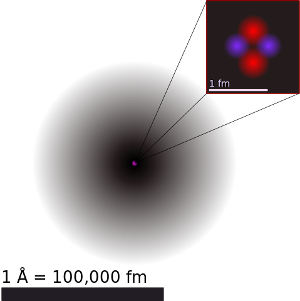
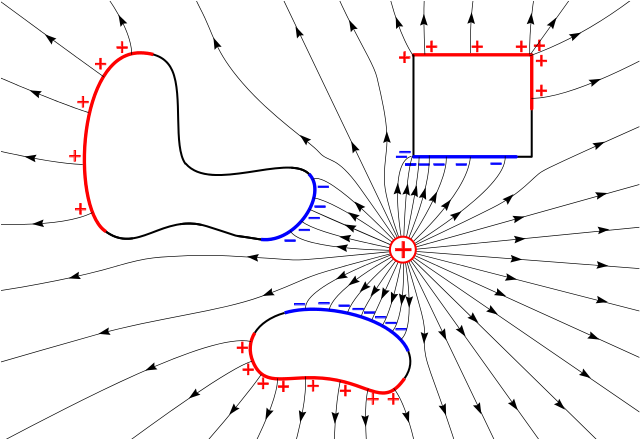
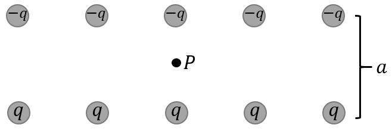
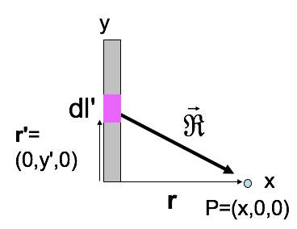

<section data-markdown="">
### PH410 - Electromagnetism

Feb 3
<!--this doesn't work... -->
</section>

<section data-markdown="">

### For Friday
- Read Griffiths 2.2
- Reading survey due at 9am 

HW2 due on Monday
	
</section>

<section data-markdown>
## Classical Electromagnetism
|  |  |
| :---: | :---: |
|  |  |

$\sim 10^8\mathrm{m} \longrightarrow \longrightarrow \longrightarrow\longrightarrow\longrightarrow\longrightarrow \sim 10^{-16}\mathrm{m}$

**24 orders of magnitude**

Note: As far we know, the theory of Classical E&M works for 24 orders of magnitude. It breaks down on the subatomic scale (QM), but we really don't know how far it extends one the upper-end as it is consistent with relativity. Tests of Jupiter's magnetic field are consistent with predictions from Classical E&M.

</section>

<section data-markdown>
## Electrostatics

</section>

<!--<section data-markdown>

Ten charges are arranged as shown. What is the E field at point P?

 

1. Zero
2. Non-zero
3. Really need trig and a calculator to decide

Note:
CORRECT ANSWER: A
</section> -->

<section data-markdown>

5 charges, q, are arranged in a regular pentagon, as shown.
What is the E field at the center?

 

1. Zero
2. Non-zero
3. Really need trig and a calculator to decide

Note:
CORRECT ANSWER: A
</section>

<section data-markdown>

1 of the 5 charges has been removed, as shown. What’s the E field at the center?

 

1. $+(kq/a^2)\hat{y}$
2. $-(kq/a^2)\hat{y}$
3. 0
4. Something entirely different!
5. This is a nasty problem which I need more time to solve

Note:
CORRECT ANSWER:  B
Superposition!

</section>

<section data-markdown>

If all the charges live on a line (1-D), use:

$$ \lambda \equiv \dfrac{\mathrm{charge}}{\mathrm{length}}$$

<!--Draw your own picture. What's $\mathbf{E}(\mathbf{r})$?-->

</section>

<section data-markdown>

To find the E-field at P from a thin line (uniform charge density $\lambda$):

$$ \mathbf{E}(\mathbf{r}) = \dfrac{1}{4\pi\varepsilon_0}\int \dfrac{\lambda dl'}{\mathfrak{R}^2}\hat{\mathfrak{R}}$$
What is $\mathfrak{R}$?

1. $x$
2. $y'$
3. $\sqrt{dl'^2 + x^2}$
4. $\sqrt{x^2+y'^2}$
5. Something else

Note:
CORRECT ANSWER: D

</section>

<section data-markdown>

$\mathbf{E}(\mathbf{r}) = \int \dfrac{\lambda dl'}{4\pi\varepsilon_0\mathfrak{R}^3}\vec{\mathfrak{R}}$, so: $E_x(x,0,0) = \dfrac{\lambda}{4\pi\varepsilon_0}\int \dots$

1. $\int \dfrac{dy'x}{x^3}$
2. $\int \dfrac{dy' x}{(x^2 + y'^2)^{3/2}}$
3. $\int \dfrac{dy' y'}{x^3}$
4. $\int \dfrac{dy' y'}{(x^2+y'^2)^{3/2}}$
5. Something else

Note:
CORRECT ANSWER: B

</section>
