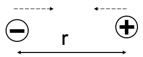
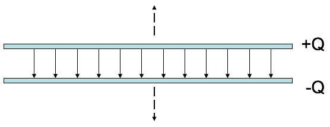
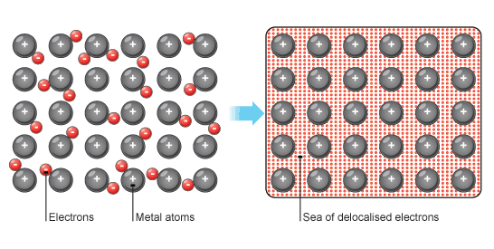
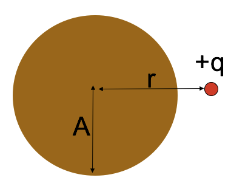
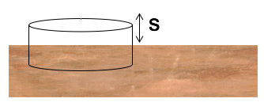
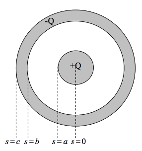
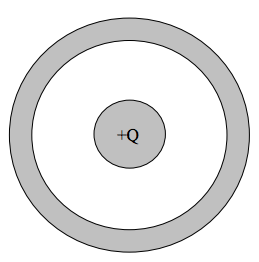

<section data-markdown="">
### PH410 - Electromagnetism

Feb 22
<!--this doesn't work... -->
</section>
<section data-markdown="">

### For Wednesday
- Read Section 2.5 in Griffiths if you missed it because I was unclear

HW5 due Friday.
	
</section>

<section data-markdown>
Review from last time:

Could this be a plot of $\left|\mathbf{E}(r)\right|$? Or $V(r)$? (for SOME physical situation?)

1. Could be $E(r)$, or $V(r)$
2. Could be $E(r)$, but can't be $V(r)$
3. Can't be $E(r)$, could be $V(r)$
4. Can't be either

Note:
* Correct Answer: B

</section>
<!--
<section data-markdown>

We usually choose $V(r\rightarrow\infty) \equiv 0$ when calculating the potential of a point charge to be $V(r) = +kq/r$. How does the potential $V(r)$ change if we choose our reference point to be $V(R) = 0$ where $R$ is close to $+q$.

1. $V(r)$ higher than it was before
2. $V(r)$ is lower than it was before
4. $V(r)$ doesn’t change ($V$ is independent of  choice of reference)

Note:
* CORRECT ANSWER: B
* Show redefinition.

</section>
-->

<section data-markdown>

### Last time, we kinda started thinking about boundary conditions

- $\mathbf{E}$ can be discontinuous, but $V$ cannot.
- Can we be more specific?
<!--- $E^\perp_{\rm above}-E^\perp_{\rm below}=\frac{\sigma}{\epsilon_0}$
- What about $E^\parallel$?-->

</section>
<section data-markdown>

### Electrostatic Potential Energy

</section>

<section data-markdown>

Consider slowly moving a positive charge from a location of low electric potential to one of high electric potential. What is the sign of the work done by you ($W_u$)? What is the sign of the work done by electric field ($W_f$)?

1. $W_u < 0$; $W_f > 0$
2. $W_u < 0$; $W_f < 0$
3. $W_u > 0$; $W_f > 0$
4. $W_u > 0$; $W_f < 0$

Note: Correct Answer is D; Draw field

</section>

<section data-markdown>

Three identical charges $+q$ sit on an equilateral triangle. What would be the final $KE$ of the top charge if you released it (keeping the other two fixed)?

1. $\frac{1}{4\pi\varepsilon_0}\frac{q^2}{a}$
2. $\frac{1}{4\pi\varepsilon_0}\frac{2q^2}{3a}$
3. $\frac{1}{4\pi\varepsilon_0}\frac{2q^2}{a}$
4. $\frac{1}{4\pi\varepsilon_0}\frac{3q^2}{a}$
5. Other

Note:
CORRECT ANSWER: C

</section>

<section data-markdown>

Three identical charges $+q$ sit on an equilateral triangle. What would be the final $KE$ of the top charge if you released *all three*?

1. $\frac{1}{4\pi\varepsilon_0}\frac{q^2}{a}$
2. $\frac{1}{4\pi\varepsilon_0}\frac{2q^2}{3a}$
3. $\frac{1}{4\pi\varepsilon_0}\frac{2q^2}{a}$
4. $\frac{1}{4\pi\varepsilon_0}\frac{3q^2}{a}$
5. Other

Note:
CORRECT ANSWER: A

</section>

<!--<section data-markdown>

Does system energy "superpose"?

That is, if you have one system of charges with total stored energy $W_1$, and a second charge distribution with $W_2$...if you superpose these charge distributions, is the total energy of the new system simply $W_1 + W_2$?

1. Yes
2. No

Note:
* CORRECT ANSWER: B
* Draw 4 charges and show that it is not the sum of the 2 charges and the other 2.

</section>-->

<section data-markdown="">

$W_{sys}=\frac{1}{2}\int V(\vec{r^\prime})\rho(\vec{r^\prime})d\tau^\prime$

where $V(\vec{r^\prime})$ is the potential at $\vec{r^\prime}$ due to all of $\rho$ except right at $\vec{r^\prime}$ (so...everything)

	
</section>

<section data-markdown>

Two charges, $+q$ and $-q$, are a distance $r$ apart.  As the charges are slowly moved together, the total field energy

$$\dfrac{\varepsilon_0}{2}\int E^2 d\tau$$

1. increases
2. decreases
3. remains constant

Note:
* CORRECT ANSWER: B
* Consider when they overlap, field goes to zero, must be E gets smaller as they get closer. same volume
</section>

<!--
<section data-markdown>

A parallel-plate capacitor has $+Q$ on one plate, $-Q$ on the other.  The plates are isolated so the charge $Q$ cannot change.  As the plates are pulled apart, the total electrostatic energy stored in the capacitor:

1. increases
2. decreases
3. remains constant.
</section>
-->
<section data-markdown>

### Conductors

</section>

<section data-markdown>

### The conductor problem

Note:
* CORRECT ANSWER: A
* Same E; constant; larger volume where it is non-zero
</section>
<!--
<section data-markdown>

A typical metal has one free election per atom. These electrons are free to move in response to external electric fields. There are $\sim 10^{22}$ free electrons in a cubic centimeter of copper. Roughly what size of electric field could a single 1cm sub of copper "respond" to by polarizing?

1. 1 N/C
2. 10 N/C
3. 100 N/C
4. 1000 N/C
5. Something more than these

Note: Correct answer is E. It's closer to 10e17 N/C

</section>
-->

<section data-markdown>

A point charge $+q$ sits outside a **solid neutral conducting copper sphere** of radius $A$. The charge q is a distance $r > A$ from the center, on the right side. What is the E-field at the center of the sphere? (Assume equilibrium situation).

1. $|E| = kq/r^2$, to left
2. $kq/r^2 > |E| > 0$, to left
3. $|E| > 0$, to right
4. $E = 0$
5. None of these

Note:
* CORRECT ANSWER: D
* Net electric field inside of a metal in static equilibrium is zero
* Talk about the net field versus the field due to the charges on the metal.

</section>

<section data-markdown>

In the previous question, suppose **the copper sphere is charged**, total charge $+Q$. (We are still in static equilibrium.) What is now the magnitude of the E-field at the center of the sphere?

1. $|E| = kq/r^2$
2. $|E| = kQ/A^2$
3. $|E| = k(q-Q)/r^2$
4. $|E| = 0$
5. None of these! / it’s hard to compute

Note:
* CORRECT ANSWER: D
* Talk about the net field versus the field due to the charges on the metal.
</section>
<section data-markdown>

We have a large copper plate with uniform surface charge density, $\sigma$.
Imagine the Gaussian surface drawn below.  Calculate the E-field a small distance $s$ above the conductor surface.

1. $|E| = \frac{\sigma}{\varepsilon_0}$
2. $|E| = \frac{\sigma}{2\varepsilon_0}$
3. $|E| = \frac{\sigma}{4\varepsilon_0}$
4. $|E| = \frac{1}{4\pi\varepsilon_0}\frac{\sigma}{s^2}$
5. $|E| = 0$

Note:
* CORRECT ANSWER: A
* Might have to do derivation and go through details of infinitely thin line charge. Must be +sigma on other side, btw.

</section>

<section data-markdown>

Consider a long coaxial with charge $+Q$ placed on the inside metal wire and $-Q$ outside metal sheath as shown.

Sketch the distribution of charge in this situtation using plus signs to represent positive chages and minus signs to represent negative charges.

Note:
* Ask them for answers, put up on board and turn into clicker question
* Answer should be plusses on outside of inner and minuses inside of outer (equal numbers)

</section>

<section data-markdown>

If you were calculating the potential difference, $\Delta V$, between the center of the inner conductor ($s=0$) and infinitely far away ($s \rightarrow \infty$), what regions of space would have a (non-zero) contribution to your calculation?

1. $s<a$
2. $a<s<b$
3. $b<s<c$
4. $s>c$
5. More than one of these

Note:
* Correct answer: E
* Should be where the metal is

</section>

<section data-markdown>
	

Now, draw the charge distribution (little + and – signs) if the inner conductor has a total charge $+Q$ on it, and the outer conductor is electrically neutral.

Note:
* Ask them for answers, put up on board and turn into clicker question
* Answer should be plusses on outside of inner and minuses inside of outer and plusses on outside of outer (equal numbers)

</section>
