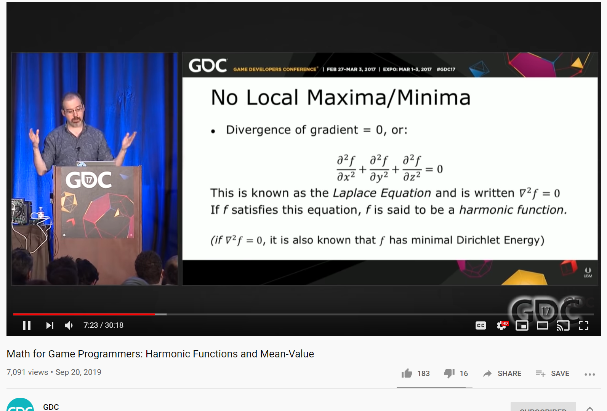

<section data-markdown="">
### PH410 - Electromagnetism

Mar 3<!--this doesn't work... -->
</section>
<section data-markdown="">

### No reading for Monday

### HW6 due friday	
</section>

<section data-markdown>

### Laplace's Equation

</section>

<section data-markdown>
	
This shows up in, like, every field. It's in thermodynamics, plasma physics, fluid dynamics, and even videogame development:

</section>

<section data-markdown>

A region of space contains no charges. What can I say about $V$ in the interior?

1. Not much, there are lots of possibilities for $V(r)$ in there
2. $V(r)=0$ everywhere in the interior.
3. $V(r)=$constant everywhere in the interior

Note:
* CORRECT ANSWER: A

</section>
<section data-markdown>

### Summary of properties w/o proof

- $V$ has no local min/max except on boundaries
- $V$ is smooth and continuous everywhere
- $V$ at a location is equal to the average over any surrounding sphere: $V(\vec{r})=\iint_{sphere} Vda$
- $V$ is unique if you know boundary conditions
</section>

<section data-markdown>

A region of space contains no charges. The boundary has V=0 everywhere.
What can I say about $V$ in the interior?

1. Not much, there are lots of possibilities for $V(r)$ in there
2. $V(r)=0$ everywhere in the interior.
3. $V(r)=$constant everywhere in the interior

Note:
* CORRECT ANSWER: B

</section>
