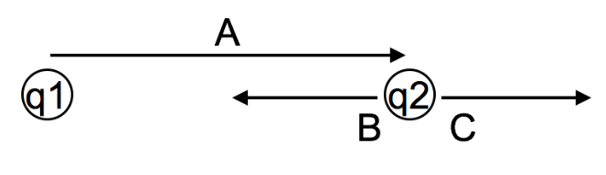
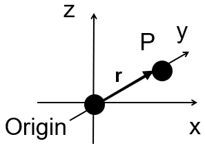

<section data-markdown="">
		
    
### PH410 - Electromagnetism

Jan 25 
 <!--this doesn't work... -->
</section>

<section data-markdown>
As we wait for class to start, chat with each other, and answer this in the poll.

Coulomb's Law: $\mathbf{F}  = \frac{k q_1 q_2}{\left|\mathfrak{R}\right|^2}\hat{\mathfrak{R}}$ where $\mathfrak{R}$ is the relative position vector. In the figure, $q_1$ and $q_2$ are 2 m apart. Which arrow **can** represent $\hat{\mathfrak{R}}$?

 

1. A
2. B
3. C
4. More than one (or NONE) of the above
5. You can't decide until you know if $q_1$ and $q_2$ are the same or opposite charges

Note:
* CORRECT ANSWER: D
* A unit vector has no units; so it's length is meaningless on a picture with units.
* Fall 2016 (hint given while still open): 14 10 9 [44] 23; students wanted to discuss E

</section>

<section data-markdown="">

### For Wednesday
- Read Griffiths Sections 1.5 & 1.6
- Do reading survey by 9am on Wednesday
### For Friday
- Homework 1 due
	
</section>

<section data-markdown>

div visualizations 

https://mathinsight.org/divergence_idea

https://mathinsight.org/divergence_subtleties

</section>

<section data-markdown>
	
 
	
</section>

<section data-markdown>
Which of the following two fields has zero divergence?

| I | II |
|:-:|:-:|
|  |   |

1. Both do.
2. Only I is zero
3. Only II is zero
4. Neither is zero
5. ???

Note:
* CORRECT ANSWER: B
* Think about dE/dx and dE/dy
</section>

<section data-markdown>
If these are electric field lines from a point charge in 3D space, what is the divergence in the boxed region?

1. Zero
2. Not zero
3. ???

Note:
* CORRECT ANSWER: A
* Lines in; lines out - harder to see dE/dx and dE/dy
* One of those curious ones where the 2D picture might get in the way; think 3D

</section>

<section data-markdown>

**True or False** The following mathematical operation makes sense and is technically valid.

$$\nabla \cdot \nabla T(x,y,z)$$

1. Yes, it will produce a vector field.
2. Yes, it will produce a scalar field.
3. No, you can not take the divergence of a scalar field.
4. I don't remember what this means.

Note:
* Correct answer: B

</section>
<section data-markdown>

Curl visualizations 

https://mathinsight.org/curl_components

https://mathinsight.org/curl_subtleties

</section>

<section data-markdown>
Which of the following two fields has zero curl?

| I | II |
|:-:|:-:|
|  |   |

1. Both do.
2. Only I is zero
3. Only II is zero
4. Neither is zero
5. ???

Note:
* CORRECT ANSWER: C
* Think about paddle wheel
</section>

<section data-markdown>

 

In cylindrical (2D) coordinates, what would be the correct description of the position vector $\mathbf{r}$ of the point P shown at $(x,y) = (1, 1)$?

1. $\mathbf{r} = \sqrt{2} \hat{s}$
2. $\mathbf{r} = \sqrt{2} \hat{s} + \pi/4 \hat{\phi}$
3. $\mathbf{r} = \sqrt{2} \hat{s} - \pi/4 \hat{\phi}$
4. $\mathbf{r} = \pi/4 \hat{\phi}$
5. Something else entirely

Note:
* CORRECT ANSWER:  A
* The position vector is different from the coordinates! The point P has r=Sqrt[2], phi=pi/4, but it is certainly not the case that, e.g. B would be the position vector. The units aren’t even correct!
* Fall 2016: [6] 90 3 0 1; Second vote (discussion and hint about units): [54] 35 4 1 4

</section>
<section data-markdown>

 

### You derive it

Consider the radial unit vector ($\hat{r}$) in the spherical coordinate system as shown in the figure.

Determine the $z$ component of this unit vector in the Cartesian $(x,y,z)$ system as a function of $r,\theta,\phi$.

Note:
This demonstrates that the r unit vector is a curious thing, in fact in contains all the information that is needed to define where you on the unit sphere. The other vectors can be though of as defined relative to that.
Altered for F2017 to be shorter, only work on z component
</section>

<section data-markdown>
 

In spherical coordinates, what would be the correct description of the position vector $\vec{r}$ of the point P shown at $(x,y,z) = (0,2~{\rm m},0)$?
1. $\vec{r}=(2~{\rm m})\hat{r}$
2. $\vec{r}=(2~{\rm m})\hat{r}+\pi\hat{\theta}$
3. $\vec{r}=(2~{\rm m})\hat{r}+\pi\hat{\theta}+\pi\hat{\phi}$
4. $\vec{r}=(2~{\rm m})\hat{r}+\pi\hat{\theta}+\frac{\pi}{2}\hat{\phi}$
5. something else

Note:
The position vector points in the “r” direction! There was a lot of discussion about this, it was clearly confusing to them. Answer D has nonsensical units. And it says that r vector has a “down” component over there. Demo: pick a coordinate system in the room and had everyone “point” in the rhat, and then phi-hat, directions, to show them that these are not constants, they are different for everyone in the room. “r_hat” has a “hidden notation”, it’s really “r_hat(r,theta,phi)”. 
Potential questions: COULD a vector have a thetahat or phihat component (how about VELOCITY of a point passing DOWN at P?) Could we could “fix it up” by putting meters in with the Pi/2’s… ?(Not in this case, A is correct). Answer A is ALSO the answer for OTHER points on that sphere, that’s right, R=2 m r_hat is by itself NOT sufficient. Writing r = (r, theta, phi) is fine, describing a point in spherical components, those three “bits” of information are what you need, but that notation is NOT the same as the cartesian, it is not saying “r r_hat + theta theta_hat + phi phi_hat”) 
  
WRITTEN BY:  Steven Pollock (CU-Boulder) This comes from research by Brant Hinrichs, it’s a known student difficulty. 

</section>

<section data-markdown>

You are trying to compute the work done by a force, $\mathbf{F} = a\hat{x} + x\hat{y}$, along the line $y=2x$ from $\langle 0,0 \rangle$ to $\langle 1,2 \rangle$. What is $d\mathbf{l}$?

1. $dl$
2. $dx\~\hat{x}$
3. $dy\~\hat{y}$
4. $2dx\~\hat{x}$
5. Something else

Note:
* CORRECT ANSWER: E
* It's $dx\~\hat{x}+dy\~\hat{y}$.
* Fall 2016 (given right at the end of class): 8 6 8 58 [20]; 5 0 3 38 [54]

</section>

<section data-markdown>

You are trying to compute the work done by a force, $\mathbf{F} = a\hat{x} + x\hat{y}$, along the line $y=2x$ from $\langle 0,0 \rangle$ to $\langle 1,2 \rangle$. Given that $d\mathbf{l} = dx\hat{x}+dy\hat{y}$, which of the following forms of the integral is correct?

1. $\int_0^1 adx + \int_0^2 xdy$
2. $\int_0^1 (adx + 2xdx)$
3. $\frac{1}{2} \int_0^2 (ady + ydy)$
4. More than one is correct

Note:
* CORRECT ANSWER: D
* All are correct forms, but B and C are ready to integrate.
* Fall 2016: 7 3 0 [90] 0

</section>

<section data-markdown>

A certain fluid has a velocity field given by $\mathbf{v} = x\hat{x} + z \hat{y}$. Which component(s) of the field contributed to "fluid flux" integral ($\int_S \mathbf{v}\cdot d\mathbf{A}$) through the x-z plane?

1. $v_x$
2. $v_y$
3. both
4. neither

Note:
* CORRECT ANSWER: B
* Only the vector perpendicular to the surface will contribute
* Fall 2016: 16 [78] 4 0 0
</section>

<section data-markdown>

A certain fluid has a velocity field given by $\mathbf{v} = x\hat{x} + z \hat{y}$. If we intend to calculate the "fluid flux" integral ($\int_S \mathbf{v}\cdot d\mathbf{A}$) through the x-z plane, what is $d\mathbf{A}$ in this case? Be specific!

1. $dxdy\hat{y}$
2. $dxdz\hat{y}$
3. $dxdz\hat{z}$
4. $dydz\hat{z}$
4. It's none of these

</section>

<section data-markdown>

For the same fluid with velocity field given by $\mathbf{v} = x\hat{x} + z \hat{y}$. What is the value of the "fluid flux" integral ($\int_S \mathbf{v}\cdot d\mathbf{A}$) through the entire x-y plane?

1. It is zero
2. It is something finite
3. It is infinite
4. I can't tell without doing the integral

Note:
* CORRECT ANSWER: A
* The velocity field is parallel to the x-y plane every where and hence contributes no flux through the surface.
* Fall 2016: [89] 9 3 0 0

</section>

<section data-markdown>

A rod (radius $R$) with a hole (radius $r$) drilled down its entire length $L$ has a mass density of $\frac{\rho_0\phi}{\phi_0}$ (where $\phi$ is the normal polar coordinate).

To find the total mass of this rod, which coordinate system should be used (take note that the mass density varies as a function of angle):

1. Cartesian ($x,y,z$)
2. Spherical ($r,\phi,\theta$)
3. Cylindrical ($s, \phi, z$)
4. It doesn't matter, just pick one.

Note:
* CORRECT ANSWER: C
* It makes the most sense from the geometry of the problem and writing the limits.
* Fall 2016: 0 0 [94] 6 0

</section>
<section data-markdown>

What is the divergence in the boxed region?

1. Zero
2. Not zero
3. ???

Note:
* CORRECT ANSWER: A
* Lines in; lines out - harder to see dE/dx and dE/dy
* One of those curious ones where the 2D picture might get in the way; think 3D

</section>

<section data-markdown>
Consider a vector field defined as the gradient of some well-behaved scalar function:
$$\mathbf{v}(x,y,z) = \nabla T(x,y,z).$$

What is the value of $\oint_C \mathbf{v} \cdot d\mathbf{l}$?

1. Zero
2. Non-zero, but finite
3. Can't tell without a function for $T$

Note:
* CORRECT ANSWER: A
* Closed loop integral of a gradient is zero.
* Fall 2016: [92] 4 4 0 0

</section>

<section data-markdown="">

## Take a minute to reflect.
What do you want out of this course? Perhaps a deeper understanding of the universe, perhaps better critical thinking skills, perhaps a certain grade. 

Are you on the right path for your own goals, whatever they are, for this semester? Are you reading how you should for where you're at with you current skills? Thinking deeply enough about the homework? 

</section>
