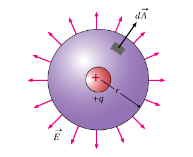
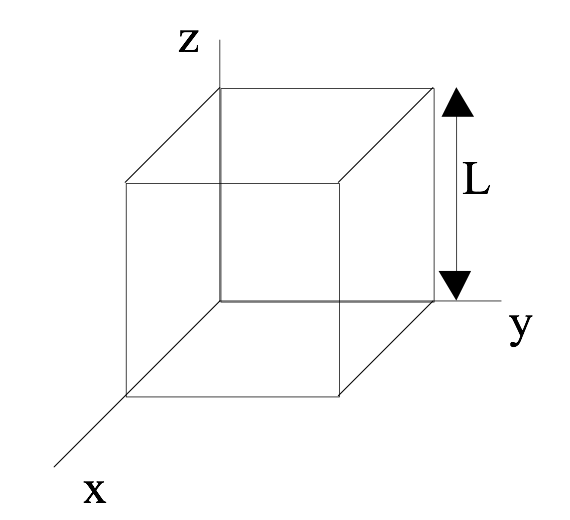

<section data-markdown="">

### PH410 - Electromagnetism

September 13
<!--this doesn't work... -->
</section>

<section data-markdown>

On slack, while we wait. Which of the following are vectors?

(I) Electric field, (II) Electric flux, and/or (III) Electric charge

1. I only
2. I and II only
3. I and III only
4. II and III only
5. I, II, and II

Note:
* CORRECT ANSWER: A

</section>
<section data-markdown="">

### For Monday
- Griffiths Section 2.3 (pp. 78-90)
- Reading survey

HW2 due today. I'll be leaving campus shortly after 4:30.
HW3 will be posted tomorrow.
	
</section>

<section data-markdown>

## Gauss' Law

$$\oint_S \mathbf{E}\cdot d\mathbf{A} = \int_V \dfrac{\rho}{\varepsilon_0}d\tau$$

</section>

<section data-markdown>

The space in and around a cubical box (edge length $L$) is filled with a constant uniform electric field, $\mathbf{E} = E_0 \hat{y}$. What is the TOTAL electric flux $\oint_S \mathbf{E} \cdot d\mathbf{A}$ through this closed surface?

1. 0
2. $E_0L^2$
3. $2E_0L^2$
4. $6E_0L^2$
5. We don't know $\rho(r)$, so can't answer.

Note:
* CORRECT ANSWER: A
* All the incoming flux on the left side comes out the right side

</section>

<section data-markdown>
A positive point charge $+q$ is placed outside a closed cylindrical surface as shown.  The closed surface consists of the flat end caps (labeled A and B) and the curved side surface (C). What is the sign of the electric flux through surface C?

1. positive
2. negative
3. zero
4. not enough information given to decide

Note:
* CORRECT ANSWER: B
* This is meant to be hard to visualize, next slide illustrates it better.

</section>

<section data-markdown>

Let's get a better look at the side view.

</section>

<section data-markdown>
A positive point charge $+q$ is placed outside a closed cylindrical surface as shown.  The closed surface consists of the flat end caps (labeled A and B) and the curved side surface (C). What is the sign of the electric flux through surface C?
	

1. positive
2. negative
3. zero
4. not enough information given to decide

Note:
* CORRECT ANSWER: B
* Some of the incoming flux through C goes out A and B.

</section>

<section data-markdown>

SLAC (Stanford Linear Accelerator Center) is where quarks (including the charm
quark), and the tauon (like a heavier electron) were discovered.

Note: Charged particles are accelerated inside a long metal cylindrical pipe, which is 2 miles long and has a radius R = 6 cm. All the air is pumped out of this pipe, known as the "beam line."
</section>
