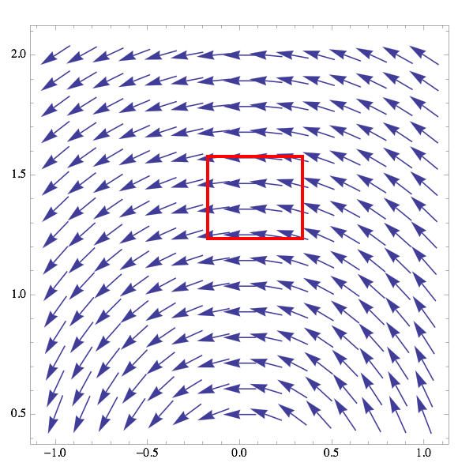
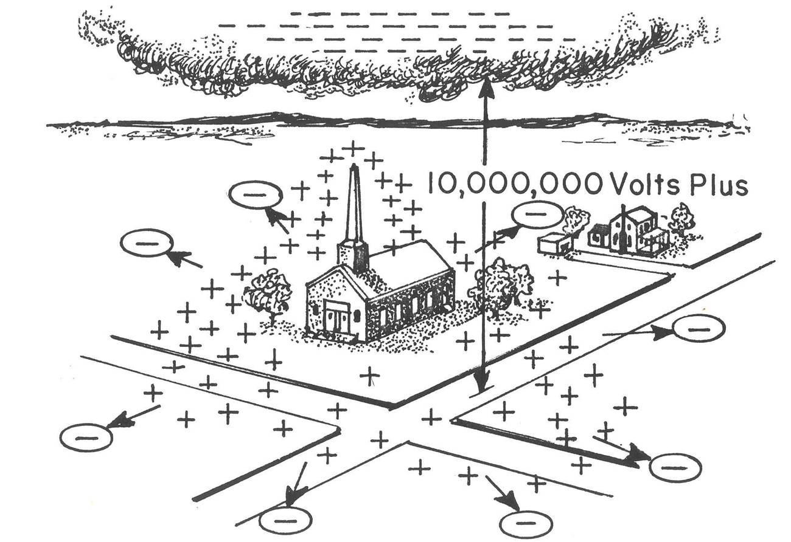

<section data-markdown="">

### PH410 - Electromagnetism

September 18
<!--this doesn't work... -->
</section>

<section data-markdown="">

### For Friday
- Griffiths Section 2.4 (pp. 91-97)
- Reading survey
- HW3 due 
	
</section>

<section data-markdown>

## Gauss's law in integral form...

$\oint_S \mathbf{E}\cdot d\mathbf{a}=\frac{Q_{\rm enc}}{\epsilon_0}$

## ...plus divergence theorem...

$\oint_S \mathbf{E}\cdot d\mathbf{a}=\int_V\left( \nabla\cdot \mathbf{E}\right) d\tau$

## ...Gauss's law in differential form

$\nabla\cdot\mathbf{E}=\rho/\epsilon_0$

</section>

<section data-markdown>

What is the divergence in the boxed region?

1. Zero
2. Not zero
3. ???

Note:
* CORRECT ANSWER: A
* Lines in; lines out - harder to see dE/dx and dE/dy
* One of those curious ones where the 2D picture might get in the way; think 3D

</section>

<section data-markdown>

We have shown twice that $\nabla \cdot \mathbf{E} = 0$ using what seem to be appropriate vector identities. But physically, $\nabla \cdot \mathbf{E} = \rho/ \varepsilon_0$. What is going on?!

</section>

<section data-markdown>

What is the curl of the vector field, $\mathbf{v}= c\hat{\phi}$, in the region shown below?

1. non-zero everywhere
2. zero at some points, non-zero at others
3. zero curl everywhere

Note:
* CORRECT ANSWER: A

</section>

<section data-markdown>

#### Div of $\mathbf{E}$ contains Guass's Law. What about curl?
Know $\mathbf{E}(\vec{r})=k\int_V \frac{\rho(\vec{r^\prime})d\tau^\prime}{|\mathfrak{r}|^2}\hat{\mathfrak{r}}$.

Also, from HW1:
- $\nabla\times\nabla f=0$
- $\nabla\frac{1}{|\mathfrak{r}|}=-\frac{\hat{\mathfrak{r}}}{|\mathfrak{r}|^2}$

</section>
<section data-markdown>

## Electric Potential

</section>
<section data-markdown>

### Stokes

$\int_S\left(\nabla\times\mathbf{E}\right)\cdot d\mathbf{a}=\oint_C\mathbf{E}\cdot d\mathbf{l}$
</section>

<section data-markdown>

If $\nabla \times \mathbf{E} = 0$, then $\oint_C \mathbf{E} \cdot d\mathbf{l} =$

1. 0
2. something finite
3. $\infty$
4. Can't tell without knowing $C$

Note:
* Correct Answer: A

</section>
<section data-markdown>

### If...

$\int_S\left(\nabla\times\mathbf{E}\right)\cdot d\mathbf{a}=\oint_C\mathbf{E}\cdot d\mathbf{l}$

### Then...

$\oint_C\mathbf{E}\cdot d\mathbf{l}=0$

</section>
<section data-markdown>

Can superposition be applied to electric potential, $V$?

$$V_{tot} \stackrel{?}{=} \sum_i V_i = V_1 +V_2 + V_3 + \dots$$

1. Yes
2. No
3. Sometimes

Note:
* Correct answer: A (usually)
As long as the zero potential is the same for all measurements.

</section>
