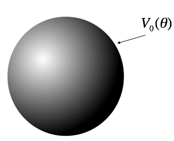
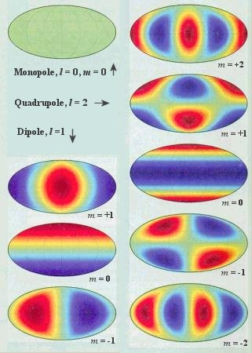

 

<section data-markdown="">

### PH410 - Electromagnetism

October 18

#### For Monday, read section 4.1

<!--this doesn't work... -->
</section>

<section data-markdown>
It's true that: $\int_{-1}^{+1}P_l(u)P_m(u)du = \dfrac{2}{2l+1}$ for $l=m$.

By what should we multiply $V_0(\theta) = \sum_l C_l P_l(\cos \theta)$ by to match this integral so we can use Fourier's Trick?

1. $P_m(\cos \theta)$
2. $P_m(\sin \theta)$
3. $P_m(\cos \theta) \sin \theta$
4. $P_m(\sin \theta) \cos \theta$
5. $P_m(\sin \theta) \sin \theta$

Note:
* CORRECT ANSWER: D

</section>
<!--
<section data-markdown>

How many boundary conditions (on the potential $V$) do you use to find $V$ inside the spherical plastic shell?

1. 1
2. 2
3. 3
4. 4
5. It depends on $V_0(\theta)$

Note:
* CORRECT ANSWER: B
* Good for discussion; obviously you need the surface BC, but what about at r=0? Is that technically a BC?
</section>
-->

<section data-markdown>

$$V(r,\theta) = \sum_{l=0}^{\infty} \left(A_l r^l + \dfrac{B_l}{r^{l+1}}\right)P_l(\cos \theta)$$

Suppose V on a spherical shell is:

$$V(R,\theta) = V_0 \left(1+\cos^2\theta\right)$$

Which terms do you expect to appear when finding **V(inside)**?
1. Many $A_l$ terms (but no $B_l$'s)
2. Many $B_l$ terms (but no $A_l$'s)
3. Just $A_0$ and $A_2$
4. Just $B_0$ and $B_2$
5. Something else!

Note:
* CORRECT ANSWER: C
* Avoid blowup and match cosine

</section>

<section data-markdown>

$$V(r,\theta) = \sum_{l=0}^{\infty} \left(A_l r^l + \dfrac{B_l}{r^{l+1}}\right)P_l(\cos \theta)$$

Suppose V on a spherical shell is:

$$V(R,\theta) = V_0 \left(1+\cos^2\theta\right)$$

Which terms do you expect to appear when finding **V(outside)**?
1. Many $A_l$ terms (but no $B_l$'s)
2. Many $B_l$ terms (but no $A_l$'s)
3. Just $A_0$ and $A_2$
4. Just $B_0$ and $B_2$
5. Something else!

Note:
* CORRECT ANSWER: D
* Avoid blowup and match cosine

</section>
<!--
<section data-markdown>

Consider a solid sphere of charge that has a charge density that varies with $\cos \theta$. What can we say about the terms in the general solution to Laplace's equation outside there sphere?

$$V(r,\theta) = \sum_l\left(A_l\,r^l + \dfrac{B_l}{r^{(l+1)}}\right)P_l(\cos \theta)$$

1. All the $A_l$'s are zero
2. All the $B_l$'s are zero
3. Only $A_0$ should remain
4. Only $B_0$ should remain
5. Something else

Note: Correct answer E because B0 and B1 remain

</section>
-->

<section data-markdown>

## Multipole Expansion

Multipole Expansion of the Power Spectrum of CMBR

Note: The radiation from cosmic microwave background can be described in terms of contributions using a basis of functions with increasing smaller contributions.

</section>
