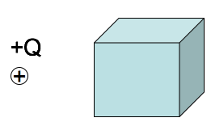
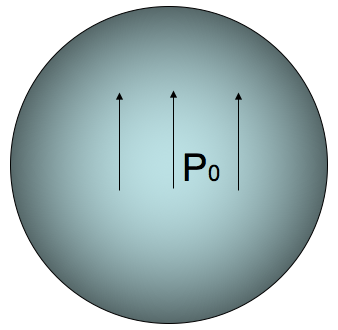
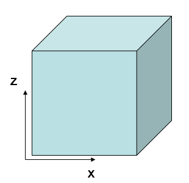
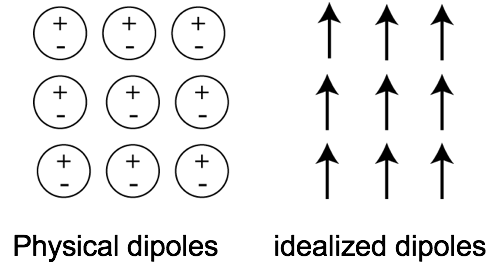
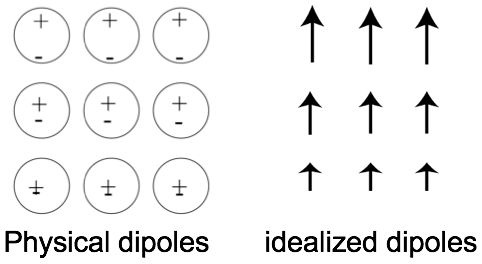
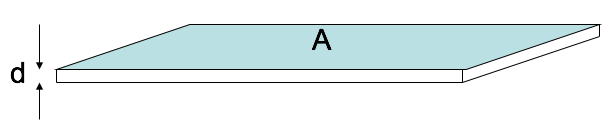

<section data-markdown>
  On slack...
  

A stationary point charge $+Q$ is near a block of polarization material (a linear dielectric).  The net electrostatic force on the block due to the point charge is:

1. attractive (to the left)
2. repulsive (to the right)
3. zero

Note:
* CORRECT ANSWER: A

</section>
<section data-markdown="">

### PH410 - Electromagnetism

October 25

#### For Monday, read section 4.4

<!--this doesn't work... -->
</section>

<section data-markdown>

## Polarization

</section>

<section data-markdown>

The sphere below (radius $a$) has uniform polarization $\mathbf{P}_0$, which points in the $+z$ direction.
What is the total dipole moment of this sphere?

1. zero
2. $\mathbf{P}_0 a^3$
3. $4\pi a^3 \mathbf{P}_0/3$
4. $\mathbf{P}_0$
5. None of these/must be more complicated

Note:
* CORRECT ANSWER: C

</section>

<section data-markdown>

The cube below (side $a$) has uniform polarization $\mathbf{P}_0$, which points in the $+z$ direction.
What is the total dipole moment of this cube?

1. zero
2. $a^3 \mathbf{P}_0$
3. $\mathbf{P}_0$
4. $\mathbf{P}_0/a^3$
5. $2 \mathbf{P}_0 a^2$

Note:
* CORRECT ANSWER: B

</section>

<section data-markdown>

In the following case, is the bound surface and volume charge zero or nonzero?

1. $\sigma_b = 0, \rho_b \neq 0$
2. $\sigma_b \neq 0, \rho_b \neq 0$
3. $\sigma_b = 0, \rho_b=0$
4. $\sigma_b \neq 0, \rho_b=0$

Note:
* CORRECT ANSWER:  D

</section>

<section data-markdown>

In the following case, is the bound surface and volume charge zero or nonzero?

1. $\sigma_b = 0, \rho_b \neq 0$
2. $\sigma_b \neq 0, \rho_b \neq 0$
3. $\sigma_b = 0, \rho_b=0$
4. $\sigma_b \neq 0, \rho_b=0$

Note:
* CORRECT ANSWER:  B

</section>

<section data-markdown>

A VERY thin slab of thickness $d$ and area $A$ has volume charge density $\rho = Q / V$. Because it's so thin, we may think of it as a surface charge density $\sigma = Q / A$.

The relation between $\rho$ and $\sigma$ is:
1. $\sigma = \rho$
2. $\sigma = \rho d$
3. $\sigma = \rho/d$
4. $\sigma = V \rho$
5. $\sigma = \rho/V$

Note:
* CORRECT ANSWER: B

</section>
