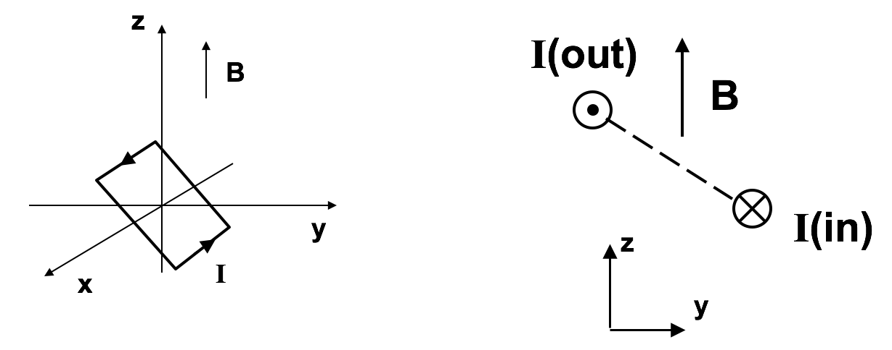
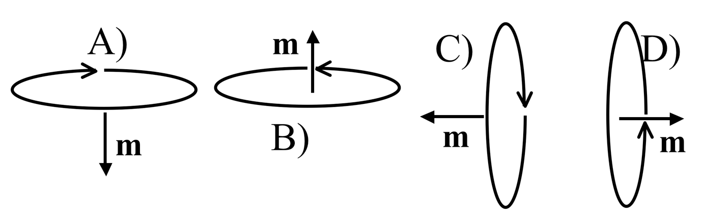

<section data-markdown="">

### PH410 - Electromagnetism

November 15

For Monday, read section 6.2 and 6.3
</section>

<section data-markdown>
The leading term in the vector potential multipole expansion involves:

$\oint d\mathbf{l}'$

What is the magnitude of this integral?

1. $R$
2. $2\pi R$
3. 0
4. Something entirely different/it depends!

Note:
* CORRECT ANSWER: C

</section>

<section data-markdown>

The vector potential for the dipole is:

$\mathbf{A}_d = \dfrac{\mu_0}{4\pi r^2} \mathbf{m} \times \hat{\mathbf{r}}$

What is the magnitude of that cross product $|\mathbf{m} \times \hat{\mathbf{r}}|$?

1. 1
2. $m$
3. $m r\sin\theta$
4. $m\sin\theta$
5. Something else?

Note: Correct Answer is D

</section>

<section data-markdown>

The vector potential for the dipole is:

$\mathbf{A}_d = \dfrac{\mu_0}{4\pi r^2} \mathbf{m} \times \hat{\mathbf{r}}$

If the magnetic dipole moment points in the $\hat{\mathbf{z}}$ direction, what is the direction of the $\mathbf{A}_d$?

1. $\hat{\mathbf{z}}$
2. $\hat{\mathbf{\phi}}$
3. $\hat{\mathbf{r}}$
4. $\hat{\mathbf{m}}$
5. Something else?

Note: Correct Answer is B

</section>

<section data-markdown>

Two magnetic dipoles $m_1$ and $m_2$ (equal in magnitude) are oriented in three different ways.

Which ones can produce a dipole field at large distances?

1. None of these
2. All three
3. 1 only
4. 1 and 2 only
5. 1 and 3 only

Note:
* CORRECT ANSWER: E

</section>

<section data-markdown>

Two magnetic dipoles $m_1$ and $m_2$ (**unequal** in magnitude) are oriented in three different ways.

Which ones can produce a dipole field at large distances?

1. None of these
2. All three
3. 1 only
4. 1 and 2 only
5. 1 and 3 only

Note:
* CORRECT ANSWER: B

</section>
<section data-markdown>

The force on a segment of wire $L$ is $\mathbf{F} = I \mathbf{L} \times \mathbf{B}$ A current-carrying wire loop is in a constant magnetic field $\mathbf{B} = B \hat{z}$ as shown. What is the direction of the torque on the loop?

1. Zero
2. +x
3. +y
4. +z
5. None of these

Note:
* CORRECT ANSWER: B
</section>

<section data-markdown>

The torque on a magnetic dipole in a B field is:

$\mathbf{\tau} = \mathbf{m} \times \mathbf{B}$

How will a small current loop line up if the B field points uniformly up the page?

</section>

