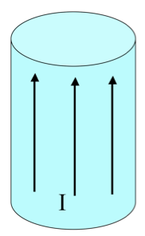
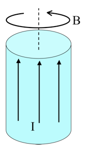
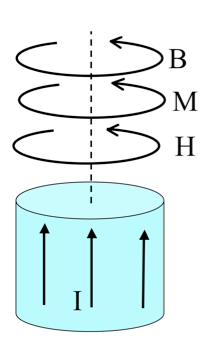

<section data-markdown="">

### PH410 - Electromagnetism

November 20

For Friday, read 7.1 & 7.2
</section>

<!--
<section data-markdown>

A very long aluminum (paramagnetic!) rod carries a uniformly distributed current $I$ along the $+z$ direction.
What is the direction of the bound volume current?

1. $\mathbf{J}_B$ points parallel to $I$
2. $\mathbf{J}_B$ points anti-parallel to $I$
3. It’s zero!
4. Other/not sure

Note:
* CORRECT ANSWER: A. Can argue by looking at magnetization (and take curl), or think about "para" & argue that B is slightly enhanced...mathematically:  “remembered” that B goes like radius (without any magnetic effects, anyway), and thus curl(M) will be proportional (if it’s linear) to curl(B), which is 1/s d/ds (s M_phi), thus 1/s d/ds s^2 = 2(constants), i.e. a positive constant. 

</section>
-->
<section data-markdown>

A very long aluminum (paramagnetic!) rod carries a uniformly distributed current $I$ along the $+z$ direction. We know $\mathbf{B}$ will be CCW as viewed from above. (Right?) What about $\mathbf{H}$ and $\mathbf{M}$ inside the cylinder?

1. Both are CCW
2. Both are CW
3. $\mathbf{H}$ is CCW, but $\mathbf{M}$ is CW
4. $\mathbf{H}$ is CW, $\mathbf{M}$ is CCW
5. ???

Note:
* CORRECT ANSWER: A. (Note that H = B/mu0 - M looks, at first glance, ambiguous - you have "CCW" minus "CCW", which one wins? Could point to integral of H dot dl = I(free, through) as direct evidence. Argument for M is that it’s a paramagnet, it should be PARAllel to B (That’s pretty much the definition of paramagnetism) 

</section>

<section data-markdown>

A very long aluminum (paramagnetic!) rod carries a uniformly distributed current $I$ along the $+z$ direction. What is the direction of the bound volume current?

1. $\mathbf{J}_B$ points parallel to $I$
2. $\mathbf{J}_B$ points anti-parallel to $I$
3. It’s zero!
4. Other/not sure

Note:
* CORRECT ANSWER: A. Can argue by looking at magnetization (and take curl), or think about "para" & argue that B is slightly enhanced...mathematically:  “remembered” that B goes like radius (without any magnetic effects, anyway), and thus curl(M) will be proportional (if it’s linear) to curl(B), which is 1/s d/ds (s M_phi), thus 1/s d/ds s^2 = 2(constants), i.e. a positive constant. 

</section>

<section data-markdown>

A very long aluminum (paramagnetic!) rod carries a uniformly distributed current $I$ along the $+z$ direction. What is the direction of the bound surface current?

1. $\mathbf{K}_B$ points parallel to $I$
2. $\mathbf{K}_B$ points anti-parallel to $I$
3. Other/not sure

Note:
* CORRECT ANSWER: B.  M cross N, and  the direct microscopic argument (draw a single dipole near edge).
</section>

<section data-markdown>

For linearly magnetizable materials, the relationship between the magnetization and the H-field is,

$\mathbf{M} = \chi_m \mathbf{H}$

What do you expect the sign of $X_m$ to be for a paramagnetic/diamagnetic material?

1. para: $\chi_m<0 \;$ dia: $\chi_m>0$
2. para: $\chi_m>0 \;$ dia: $\chi_m<0$
3. Both positive
4. Both negative

Note:
Correct answer: B

</section>
